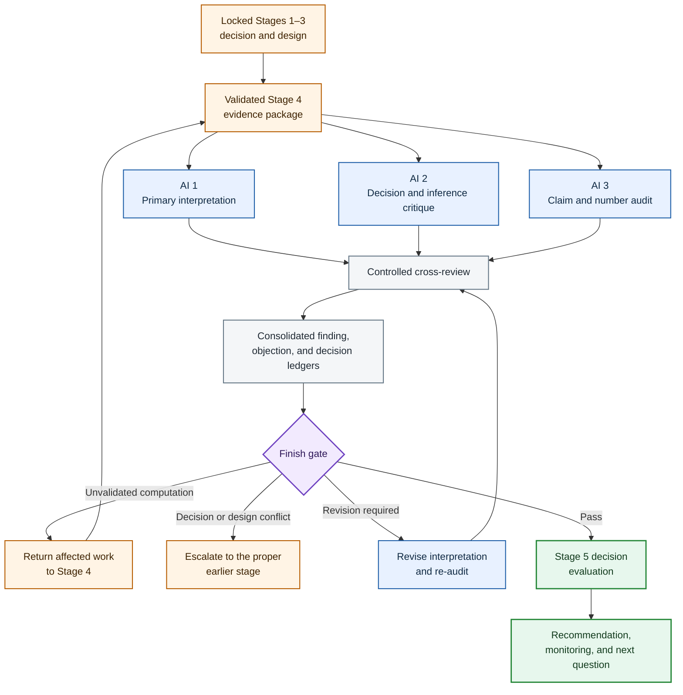
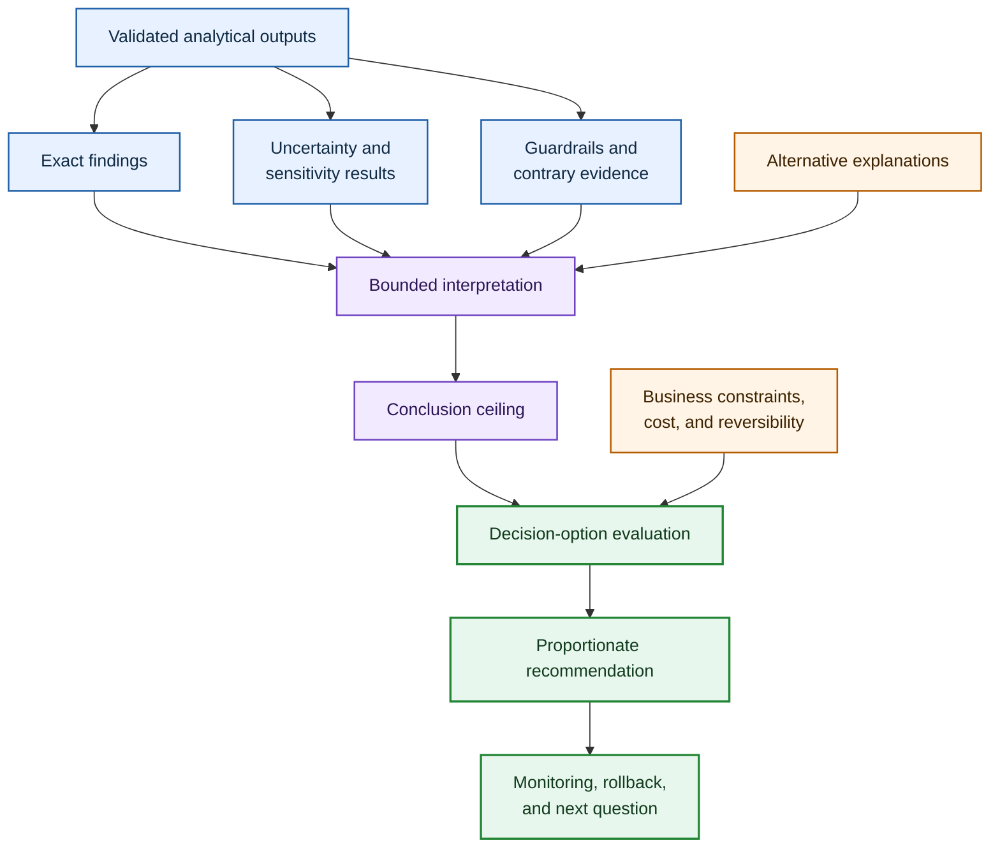

# Three-AI Interpretation and Recommendation Framework

This framework governs Stage 5, **Finish**, of the five-stage AI-Augmented Analyst process.

Its purpose is to convert validated analytical evidence into a disciplined interpretation, evaluate whether the evidence is sufficient for the approved decision, and recommend a proportionate next action.

Stage 5 must answer:

- What do the validated results show?
- How strongly do they support the primary hypothesis?
- What do they not establish?
- Which alternative explanations remain?
- Is there enough evidence to act?
- Which action is proportionate to the evidence, uncertainty, cost, and reversibility?
- What must be monitored after the decision?

The three AIs perform different functions:

- **AI 1 builds the primary interpretation and recommendation.**
- **AI 2 independently challenges the inference and evaluates the decision options.**
- **AI 3 audits every material claim against the validated evidence and independently checks critical results.**

The governing principle is:

> State exactly what the evidence supports, state exactly what it does not support, and recommend no action stronger than the evidence warrants.

The AIs do not vote on the recommendation. A conclusion survives because it is traceable to validated evidence, respects the locked measurement design, survives the strongest alternative interpretation, and supports an action under the approved decision rules.

## 1. Position within the five-stage process

| Stage | Function | Controlling output |
|---|---|---|
| 1. Start | Identify the business decision | Approved decision statement |
| 2. Framing | Convert the decision into one analytical question | Locked analytical question |
| 3. Design | Define what will count as evidence | Locked measurement design |
| 4. Execution | Construct, reconcile, review, and analyze the evidence | Validated analytical package |
| 5. Finish | Interpret the evidence and evaluate the decision | Proportionate recommendation and monitoring plan |

Stage 5 is not a second execution phase.

It may inspect code, predictions, tables, and calculations to verify a claim. It may not silently create a new population, metric, model, segment, or decision rule. Any material new computation returns to Stage 4 and any material change to the decision or measurement design returns to the proper earlier stage.

## 2. What Finish must establish

There are six separate tasks.

| Task | Controlling question |
|---|---|
| Evidence interpretation | What do the validated results literally show? |
| Hypothesis evaluation | How do those results bear on the prespecified hypothesis? |
| Limitation control | What does the evidence fail to establish? |
| Decision evaluation | Which approved option is best supported? |
| Recommendation | What action is proportionate to evidence and uncertainty? |
| Learning plan | What should be monitored or investigated next? |

A technically valid result does not automatically determine a business action. Stage 5 makes every link from evidence to recommendation visible.

## 3. Required Stage 5 input package

All three AIs receive the same versioned Stage 5 Evidence Package.

### Locked business and design inputs

- original stakeholder request;
- approved decision statement;
- locked analytical question;
- decision owner;
- available decision options;
- intended outcome;
- capacity, policy, risk, and timing constraints;
- required exceptions;
- Stage 3 hypothesis hierarchy;
- primary KPI and metric contracts;
- population and grain;
- comparison and baseline rules;
- segment definitions;
- confounder and competing-explanation ledger;
- decision rules;
- intended conclusion type and ceiling;
- and accepted measurement limitations.

### Validated Stage 4 inputs

- SQL A and SQL B outputs where relevant;
- R(B) reconstruction output;
- exact reconciliation report;
- cross-review reports;
- issue register and dispositions;
- validated-data manifest;
- deeper R analysis;
- approved tables and figures;
- statistical or predictive results;
- methodological review;
- implementation review;
- independent checks of critical results;
- sensitivity analyses;
- model or forecast evaluation artifacts;
- and unresolved limitations.

### File inventory requirement

Before interpreting, record every file or verified repository link found and every file actually used.

Do not claim access to a file that was not retrieved. Do not invent missing execution results, targets, constraints, fields, or validations.

## 4. Lock-preservation rule

Stage 5 consumes earlier locks; it does not reopen them merely because a different definition would produce a cleaner story.

No AI may silently change:

- the decision;
- analytical question;
- population;
- grain;
- KPI;
- denominator;
- comparison group;
- volume floor;
- segment definition;
- model evaluation metric;
- decision threshold;
- or capacity rule.

If an earlier lock appears defective, record the exact defect and its likely effect. Route it back to the stage that owns it. Do not repair it inside the prose of the final interpretation.

## 5. Human authority and AI boundaries

### Decision owner

The decision owner controls:

- business priorities;
- risk tolerance;
- operational feasibility;
- resource allocation;
- and the final organizational action.

### Human analyst

The human analyst owns:

- the final synthesis;
- acceptance or rejection of AI recommendations;
- disclosure of judgment calls;
- escalation to earlier stages;
- and approval of the final Stage 5 document.

### AI boundaries

The AIs may evaluate the decision but may not:

- invent business preferences;
- conceal uncertainty to make the recommendation decisive;
- turn association into causation;
- select only favorable results;
- or treat AI agreement as stakeholder authorization.

## 6. The three AI roles

### AI 1 — Evidence Synthesis and Recommendation Builder

AI 1 constructs the primary Stage 5 interpretation.

Its responsibilities are to:

- inventory the validated evidence;
- state the direct answer to the analytical question;
- classify each finding;
- evaluate the primary and secondary hypotheses;
- distinguish primary, supporting, guardrail, and diagnostic evidence;
- preserve uncertainty and limitations;
- compare the approved decision options;
- apply the locked decision rules;
- draft one recommendation;
- and define monitoring and the next analytical question.

AI 1 owns coherence, not truth by declaration.

### AI 2 — Decision and Methodological Critic

AI 2 independently interprets the same evidence before seeing AI 1's draft.

It tests:

- whether the evidence answers the approved question;
- whether the main hypothesis is supported, weakened, mixed, or unresolved;
- whether statistical significance is being confused with business importance;
- whether effect size and uncertainty are proportionate to the recommendation;
- whether descriptive, associational, predictive, and causal claims are separated;
- whether alternative explanations remain;
- whether contradictory or null results are being hidden;
- whether capacity and risk constraints change the preferred action;
- and whether a pilot, monitoring, more evidence, or no action is more defensible than full action.

AI 2 must give the strongest rival interpretation and the strongest alternative recommendation.

### AI 3 — Claim-to-Evidence and Numerical Auditor

AI 3 initially audits the evidence package without seeing AI 1 or AI 2's interpretation.

Its responsibilities are to:

- build the authoritative result inventory;
- identify which outputs passed validation;
- trace every material number to its source artifact;
- independently recompute critical metrics where practical;
- verify populations, denominators, labels, time windows, and segment names;
- verify that model metrics come from the approved held-out data;
- check that tables and charts agree;
- confirm that decision rules were applied as locked;
- and flag any claim requiring an unvalidated computation.

AI 3 controls traceability, not the business decision.

## 7. Independence before cross-review

The first-pass outputs are independent.

| AI | Initial output | Must not see initially |
|---|---|---|
| AI 1 | Primary interpretation and recommendation | AI 2 interpretation and AI 3 audit |
| AI 2 | Independent decision evaluation and rival interpretation | AI 1 draft and AI 3 audit |
| AI 3 | Result inventory and claim-to-evidence audit | AI 1 and AI 2 interpretations |

This separation reduces narrative anchoring.

If AI 2 merely comments on AI 1's recommendation, it may inherit the same framing. If AI 3 begins from the executive summary rather than the analytical artifacts, it may verify only the claims the builder chose to mention.

## 8. Evidence-status vocabulary

Every material result receives one status:

- **Validated:** Passed the relevant Stage 4 construction and review gates.
- **Validated with limitation:** Computation is sound, but interpretation is materially bounded.
- **Sensitivity-dependent:** Changes under a reasonable alternative definition or assumption.
- **Conflicting:** Material approved outputs point in different directions.
- **Inconclusive:** Evidence does not discriminate sufficiently.
- **Unsupported:** The claim is not established by an approved output.
- **Unverified:** Source or calculation has not passed the required check.
- **Rejected:** Fails computational, methodological, or traceability review.

Only validated evidence may support an unqualified central finding.

## 9. Finding classification

Every finding must be classified before it enters the narrative.

### Conclusive for the defined question

The validated evidence directly answers the approved descriptive, comparative, or predictive question within the locked population and time window.

“Conclusive” does not mean universally true or causal unless the design supports that level.

### Inconclusive

The evidence is too weak, imprecise, unstable, sparse, or indirect to choose among material interpretations.

### Conflicting

Primary, guardrail, segment, sensitivity, or model results point toward different decisions.

### Unsupported

The statement goes beyond the validated evidence or requires an unavailable analysis.

### Decision relevance

A statistically correct finding may still be irrelevant if it cannot change the approved action.

Each finding must state what decision consequence, if any, follows from it.

## 10. Claim taxonomy and conclusion ceiling

Every material sentence must be identified as one of the following:

- **Observed fact:** A property directly present in the validated data.
- **Computed result:** A reproducible statistic or model output.
- **Method-dependent estimate:** A result that depends materially on model or design assumptions.
- **Interpretation:** A reasoned account of what a result means.
- **Business judgment:** A value, risk, feasibility, or priority choice.
- **Recommendation:** A proposed action based on evidence plus judgment.

The intended conclusion type from Stage 3 remains the ceiling:

- descriptive;
- comparative;
- associational;
- predictive;
- or causal.

A predictive model can identify elevated risk without establishing why the risk exists. A descriptive segment difference can motivate investigation without establishing that segment membership causes the outcome.

## 11. The evidence-to-action chain

Every recommendation must preserve the complete inferential chain.

No link may be replaced by rhetoric.

## 12. Result inventory

Before interpretation, AI 3 creates a Result Inventory.

| Field | Required content |
|---|---|
| Result ID | Stable identifier |
| Exact result | Unrounded value and presentation value |
| Artifact | File, table, figure, or model object |
| Population | Exact covered observations |
| Grain | Unit of the result |
| Time window | Exact period |
| Method | Descriptive, test, model, forecast, or decision rule |
| Validation status | Relevant Stage 4 gate or check |
| Independent check | Recalculation or review record |
| Limitation | Material interpretive boundary |
| Permitted use | Central, supporting, guardrail, diagnostic, or excluded |

The inventory prevents an attractive chart from becoming evidence merely because it appears in a report.

## 13. Finding Ledger

| Field | Required content |
|---|---|
| Finding ID | Stable identifier |
| Exact proposition | One testable statement |
| Supporting Result IDs | Validated evidence |
| Contrary Result IDs | Evidence pointing elsewhere |
| Status | Conclusive, inconclusive, conflicting, or unsupported |
| Conclusion type | Descriptive, comparative, associational, predictive, or causal |
| Confidence | High, medium, low, or not estimable |
| Decision relevance | Action the finding could change |
| Limitation | Scope boundary |

Each finding must be able to survive removal from the surrounding prose. If it becomes misleading when stated alone, it is probably hiding a condition or limitation.

## 14. Claim-to-Evidence Ledger

Every material claim in the final document must be traceable.

| Field | Required content |
|---|---|
| Claim ID | Stable identifier |
| Final wording | Exact sentence or bullet |
| Claim type | Fact, result, estimate, interpretation, judgment, or recommendation |
| Evidence | Result IDs and source artifacts |
| Calculation | Formula or transformation where relevant |
| Independent check | Reviewer and check record |
| Assumptions | Required premises |
| Limitation | What the claim does not establish |
| Status | Approved, revise, remove, open, or disputed |

Numbers in the executive summary, body, chart, and appendix must agree.

## 15. Hypothesis evaluation

Evaluate every prespecified hypothesis using the Stage 3 observable implications and counterevidence.

For each hypothesis state:

- exact hypothesis;
- evidence expected under it;
- evidence actually observed;
- evidence against it;
- sensitivity to definitions or models;
- whether the result is supported, partly supported, weakened, rejected, or unresolved;
- and the permitted conclusion.

Do not convert failure to reject a statistical null into proof that no meaningful effect exists. Do not convert a small p-value into evidence that an effect is operationally important.

## 16. Primary, supporting, guardrail, and diagnostic evidence

The evidence hierarchy from Stage 3 must remain visible.

### Primary KPI

Carries the main decision burden.

### Supporting metrics

Strengthen or contextualize the primary result but do not replace it without reopening Stage 3.

### Guardrail metrics

May block or weaken an otherwise attractive recommendation.

### Diagnostic metrics

Help explain the pattern but may not justify action independently.

### Audit metrics

Support computational trust; they are not business outcomes.

When the primary KPI and guardrails conflict, the conflict must appear in the direct answer rather than only in an appendix.

## 17. Statistical and practical significance

Stage 5 must separately assess:

- effect direction;
- effect magnitude;
- uncertainty interval;
- sample size;
- baseline rate;
- stability across sensitivity analyses;
- practical importance;
- and relevance to the capacity-constrained decision.

An effect can be statistically detectable but too small to matter. An operationally large effect can remain uncertain because the sample is limited. Both facts belong in the interpretation.

## 18. Alternative-Explanation Ledger

AI 2 constructs the strongest non-preferred explanation of the evidence.

| Field | Required content |
|---|---|
| Alternative ID | Stable identifier |
| Explanation | Exact competing account |
| Evidence supporting it | Result IDs or known limitations |
| Evidence against it | Result IDs |
| Confounder relation | Link to Stage 3 risk |
| Test performed | Adjustment, stratification, sensitivity, or none |
| Residual plausibility | High, medium, low, or unknown |
| Effect on recommendation | No change, weaken, pilot, delay, reject, or branch |

An alternative explanation is not defeated merely because it lacks a dedicated model. Conversely, listing a possibility does not make it equally probable. Assess it against the actual evidence.

## 19. Decision-Option Matrix

Evaluate every approved option, including inaction where relevant.

| Field | Required content |
|---|---|
| Option | Exact action |
| Evidence required | What would support it |
| Evidence observed | Validated findings |
| Expected benefit | Decision-relevant upside |
| Downside and cost | Material harm or resource use |
| Uncertainty | What is not known |
| Capacity fit | Operational feasibility |
| Reversibility | Ease of stopping or correcting |
| Guardrail impact | Risk to protected outcomes |
| Evidence gap | Missing information |
| Verdict | Act, pilot, monitor, collect evidence, no action, or reject |

Do not collapse the matrix into an unexplained numerical score. If weights or utility values are used, they must come from an approved decision model rather than an AI's preference.

## 20. Proportionality rule

Recommendation strength must depend on both evidence and action risk.

General pattern:

| Evidence and action condition | Proportionate response |
|---|---|
| Strong, stable evidence; low-cost and reversible action | Act within the locked rule |
| Promising evidence; material uncertainty; reversible intervention | Run a bounded pilot |
| Weak or sparse evidence; low urgency | Monitor or collect more evidence |
| Conflicting primary and guardrail results | Delay, narrow, or branch the action |
| Unsupported causal mechanism | Avoid causal claims; consider descriptive targeting only |
| High-cost or irreversible action with uncertain benefit | Require stronger evidence or formal decision analysis |
| Evidence contradicts the proposed action | Recommend no action or a different option |

This table guides reasoning; it does not replace project-specific judgment.

## 21. Recommendation contract

The final recommendation must state:

- exact action;
- decision owner;
- target population or entities;
- timing;
- capacity limit;
- evidence threshold;
- expected benefit;
- most important risk;
- confidence level;
- exception path;
- monitoring metric;
- review date or trigger;
- and rollback or escalation condition.

“Investigate further” is not a complete recommendation unless it specifies what evidence to collect, why it matters, who owns it, and what later decision it will enable.

## 22. Monitoring and learning contract

A recommendation is incomplete without a post-decision learning plan.

Specify:

- implementation date;
- exposed or affected units;
- primary outcome;
- guardrail outcomes;
- leading indicators;
- lagging indicators;
- comparison or baseline;
- observation window;
- reporting cadence;
- success threshold;
- failure threshold;
- rollback trigger;
- review owner;
- and the next decision date.

If the recommendation is a pilot, define what result would justify scaling, revising, or stopping it.

## 23. Phase 1 — Evidence-package audit

Before any interpretation is drafted, all three AIs confirm:

- required files are present;
- file versions are recorded;
- Stage 4 reconciliation passed;
- cross-review issues are resolved or disclosed;
- approved deeper-analysis outputs are identifiable;
- critical-result checks are present;
- and no superseded output is being treated as current.

If a material artifact is missing, Stage 5 pauses or explicitly narrows its scope.

## 24. Phase 2 — Independent first-pass outputs

### AI 1 output

AI 1 produces:

1. Direct answer.
2. Strongest evidence.
3. Hypothesis evaluation.
4. What the evidence does not establish.
5. Most important caveat.
6. Decision-option matrix.
7. Primary recommendation.
8. Monitoring plan.
9. Next analytical question.
10. Weakest bridge in its own reasoning.

### AI 2 output

AI 2 independently produces:

1. Its own direct answer.
2. Strongest rival interpretation.
3. Strongest alternative recommendation.
4. Statistical-versus-practical-significance assessment.
5. Causal-ceiling assessment.
6. Alternative-Explanation Ledger.
7. Risk and reversibility assessment.
8. Evidence that would change its verdict.
9. Most important omitted result or option.
10. Decision verdict.

### AI 3 output

AI 3 independently produces:

1. File inventory.
2. Result Inventory.
3. Independent checks of critical values.
4. Population, grain, and time-window verification.
5. Table-to-chart consistency audit.
6. Model or forecast metric audit where applicable.
7. Decision-rule application audit.
8. Unsupported-claim list.
9. Unvalidated-computation list.
10. Evidence-traceability verdict.

## 25. Phase 3 — Controlled cross-review

After all independent outputs are complete, create one Cross-Review Packet.

### AI 1 cross-review

AI 1 reviews AI 2 and AI 3 for:

- objections that require a weaker conclusion;
- stronger alternative explanations;
- errors in its result selection;
- missing guardrails;
- unsupported numbers;
- and improvements to the recommendation.

Return **Keep**, **Revise**, **Weaken**, **Branch**, or **Remove** for each affected claim.

### AI 2 cross-review

AI 2 reviews AI 1 and AI 3 for:

- overclaim;
- hidden causality;
- selective emphasis;
- underweighted uncertainty;
- ignored null or contrary evidence;
- non-proportionate action;
- and failure to consider pilot, monitoring, or no action.

Return **Supported**, **Overstated**, **Decision-dependent**, **Inconclusive**, or **Unsupported**.

### AI 3 cross-review

AI 3 reviews AI 1 and AI 2 for:

- incorrect values;
- denominator changes;
- population drift;
- mismatched time windows;
- wrong segment labels;
- obsolete results;
- claims not found in an approved artifact;
- and recommendations that do not follow the locked decision rule.

Return **Verified**, **Correct**, **Qualify**, **Recompute in Stage 4**, or **Remove**.

Every review finding must identify an exact Claim ID, Finding ID, Result ID, or quoted sentence.

## 26. Phase 4 — Reconciliation of interpretations

Create an Interpretation Reconciliation Matrix.

| Issue | AI 1 | AI 2 | AI 3 evidence | Resolution | Residual uncertainty |
|---|---|---|---|---|---|
| Direct answer | Exact answer | Exact answer | Controlling results | Preserve, revise, or branch | Exact limitation |
| Hypothesis status | Builder verdict | Critic verdict | Result trace | Supported, mixed, weak, or unresolved | Remaining risk |
| Conclusion ceiling | Proposed level | Critique | Design lock | Exact permitted wording | Excluded claim |
| Decision option | Preferred option | Alternative | Rule application | Human-approved verdict | Tradeoff |
| Recommendation | Proposed action | Proportionality critique | Evidence check | Act, pilot, monitor, collect, or no action | Monitoring need |

No disagreement is resolved by counting votes.

Use:

- validated results;
- locked decision rules;
- methodological principles;
- business constraints;
- and explicit human judgment.

If two interpretations remain defensible, state the branch and the condition under which each would be preferred.

## 27. Phase 5 — Candidate decision evaluation

AI 1 constructs `Stage_05_Decision_Evaluation.md` after accepted resolutions.

Every material statement must carry:

- a Claim ID;
- evidence status;
- conclusion type;
- confidence;
- and relevant limitation.

The executive prose may omit visible IDs for readability only when the underlying ledger remains complete.

## 28. Phase 6 — Dual final audit

AI 2 and AI 3 independently audit the candidate document.

### AI 2 final inference audit

Check:

- direct answer proportional to evidence;
- strongest rival interpretation preserved;
- uncertainty visible;
- causal ceiling respected;
- hypothesis verdict supported;
- action options fairly compared;
- recommendation proportionate to risk and reversibility;
- no-action or pilot considered where relevant;
- and monitoring capable of testing the recommendation.

Final status:

- **INFERENCE PASS**
- **INFERENCE PASS WITH REQUIRED REVISIONS**
- **INFERENCE FAIL**

### AI 3 final evidence audit

Check:

- every material number;
- every table and chart reference;
- every population and time-window statement;
- every model metric;
- every segment label;
- every decision-rule application;
- every source-file reference;
- and every claimed independent check.

Final status:

- **EVIDENCE PASS**
- **EVIDENCE PASS WITH REQUIRED REVISIONS**
- **EVIDENCE FAIL**

Every required revision must quote the affected language and provide a precise correction.

## 29. Mandatory Finish Gates

### Gate 1 — Input and validation

- Required files found and used.
- Versions recorded.
- Stage 4 validation status confirmed.
- Superseded outputs excluded.
- Unresolved Stage 4 limitations preserved.

### Gate 2 — Lock integrity

- Approved decision and question unchanged.
- Population, grain, KPI, segments, and rules unchanged.
- Any necessary upstream revision formally escalated.

### Gate 3 — Finding classification

- Conclusive, inconclusive, conflicting, and unsupported findings separated.
- Primary, supporting, guardrail, diagnostic, and audit evidence distinguished.
- Null and contrary results visible.

### Gate 4 — Inference and conclusion ceiling

- Observation separated from inference.
- Association separated from causation.
- Prediction separated from explanation.
- Intended Stage 3 conclusion ceiling respected.

### Gate 5 — Statistical and practical significance

- Effect direction, magnitude, uncertainty, and sample size considered.
- Statistical significance not confused with materiality.
- Sensitivity and stability results represented.

### Gate 6 — Alternative explanations

- Strongest rival interpretation presented.
- Material confounders and residual risks disclosed.
- Alternative recommendations considered.

### Gate 7 — Evidence traceability

- Every material claim traces to a validated artifact.
- Critical numbers independently checked where practical.
- Tables, charts, and narrative agree.
- No unvalidated computation enters the conclusion.

### Gate 8 — Decision evaluation

- All approved options evaluated.
- Locked decision rules correctly applied.
- Capacity, cost, risk, and reversibility included.
- Insufficient-evidence and no-action paths remain available.

### Gate 9 — Recommendation proportionality

- Action strength matches evidence strength.
- Exact owner, target, timing, and constraint stated.
- Most important caveat appears beside the recommendation.
- Confidence is explicit.

### Gate 10 — Monitoring and learning

- Primary and guardrail monitoring defined.
- Success, failure, escalation, and rollback triggers stated.
- Review timing and owner stated.
- Next analytical question identified.

### Gate 11 — Communication and ownership

- Executive format complete.
- Technical appendix and ledgers retained.
- AI disagreement resolved through evidence, not voting.
- Successful objections changed the wording or action.
- Human analyst approved the final document.
- Decision owner remains responsible for the action.

## 30. Exact executive output format

The front of `Stage_05_Decision_Evaluation.md` must contain these six sections in this order.

### 1. Direct answer

Answer the approved analytical question in plain language. State confidence and whether the evidence supports action.

### 2. Strongest evidence

Present the few validated results carrying the greatest decision weight. Preserve magnitude, denominator, uncertainty, and comparison.

### 3. What the evidence does not establish

State the strongest tempting conclusion that the analysis cannot support.

### 4. Most important caveat

Identify the single limitation most capable of changing the interpretation or action.

### 5. Specific recommended action

State who should do what, to whom or where, when, within what capacity, and under which exception or guardrail.

### 6. What to measure next

Define the monitoring plan, success and failure signals, and the next analytical question.

The executive version may then be compressed into:

- three decision bullets;
- one primary chart;
- and three next actions.

The compact version must sit on top of the full evidence trail rather than replace it.

## 31. What passing the Finish Gates proves

| Passing establishes | Passing does not establish |
|---|---|
| The interpretation is traceable to validated evidence | The decision is risk-free |
| Material uncertainty and alternatives were reviewed | Every reviewer prefers the same action |
| The recommendation follows the approved decision rules | The expected benefit is guaranteed |
| Causal and predictive limits are explicit | Unmeasured confounding has disappeared |
| Action strength is proportionate to current evidence | Conditions will remain stable indefinitely |
| Monitoring and rollback are defined | Future evidence cannot change the recommendation |

## 32. Illustrative FulfillIQ interpretation fragment

This example shows the required form without inventing execution results.

### Direct answer

State whether the validated seller-level evidence supports intervention under the locked eligibility, peer, and capacity rules. Insert only verified counts and rates from the approved Stage 4 outputs.

### Strongest evidence

Use:

- validated seller-order denominators;
- validated date-based late-fulfillment rates;
- the timestamp sensitivity twin;
- approved peer comparisons;
- volume-floor status;
- and any independently checked deeper-analysis result that materially affects prioritization.

### What the evidence does not establish

The observational analysis does not by itself establish that an intervention will cause fulfillment performance to improve.

### Most important caveat

State the actual leading limitation from the validated issue register, such as limited historical coverage, unstable low-volume rates, or an unmeasured operational factor. Do not choose a caveat merely because it sounds conventional.

### Specific action

Apply the locked selection rule within the approximate capacity of 20 concurrent plans. Preserve severe low-volume sellers as a separate review category rather than silently treating them as stable high-volume estimates.

### What to measure next

Define post-enrollment late-fulfillment performance, guardrails, observation window, comparison logic, and escalation or rollback rules before claiming intervention effectiveness.

The actual Stage 5 document must replace this structure with validated project results; it may not invent the seller list, counts, rates, or effect sizes.

## 33. Failure conditions

The process fails if:

- Stage 5 begins before Stage 4 evidence is validated;
- a missing file or result is invented;
- an obsolete output is used;
- an earlier decision, population, grain, KPI, segment, or threshold is silently changed;
- a new computation is performed without returning it to Stage 4 validation;
- the preferred recommendation determines which findings are reported;
- null, negative, or guardrail results are hidden;
- a diagnostic metric replaces the primary KPI without reopening Stage 3;
- statistical significance is equated with business importance;
- lack of statistical significance is equated with proof of no effect;
- association is described as causation;
- prediction is described as explanation;
- a model metric is taken from training or tuning data instead of the approved held-out set;
- denominators, populations, or time windows drift between tables and prose;
- chart labels do not match the underlying result;
- exploratory segments are presented as prespecified confirmation;
- sensitivity-dependent findings are presented as stable;
- the strongest alternative explanation is omitted;
- uncertainty is hidden to produce a decisive tone;
- only one decision option is evaluated;
- pilot, monitoring, more evidence, or no action is excluded without reason;
- operational capacity or risk is ignored;
- the action is stronger or less reversible than the evidence warrants;
- a recommendation lacks owner, target, timing, or monitoring;
- “investigate further” is offered without specifying what to investigate and why;
- a critical number is trusted only because AI 1 reported it;
- the AIs resolve disagreement by voting;
- a successful objection is hidden;
- stakeholder authorization is inferred from AI agreement;
- or the final recommendation cannot be traced through finding, evidence, decision rule, and limitation.

## 34. Required deliverables

The process produces:

1. `01_STAGE_05_EVIDENCE_PACKAGE.md`
2. `02_RESULT_INVENTORY.md`
3. `03_AI1_PRIMARY_INTERPRETATION.md`
4. `04_AI2_DECISION_AND_INFERENCE_CRITIQUE.md`
5. `05_AI3_CLAIM_TO_EVIDENCE_AUDIT.md`
6. `06_FINDING_AND_ALTERNATIVE_EXPLANATION_LEDGERS.md`
7. `07_DECISION_OPTION_MATRIX.md`
8. `08_CROSS_REVIEW_AND_RECONCILIATION.md`
9. `09_CANDIDATE_DECISION_EVALUATION.md`
10. `10_FINAL_INFERENCE_AND_EVIDENCE_AUDITS.md`
11. `11_STAGE_05_DECISION_EVALUATION.md`
12. `12_MONITORING_AND_NEXT_QUESTION_PLAN.md`

These files may be combined into one controlled document when every component remains identifiable and versioned.

## 35. Complete operating sequence

1. Receive the locked Stages 1–3 materials and validated Stage 4 package.
2. Inventory every file and version actually used.
3. Confirm Stage 4 reconciliation, cross-review, and deeper-analysis review status.
4. Have AI 1 construct the primary interpretation independently.
5. Have AI 2 construct the rival interpretation and decision evaluation independently.
6. Have AI 3 build the Result Inventory and numerical audit independently.
7. Remove the information barriers only after the first passes are complete.
8. Cross-review exact claims, findings, results, and recommendation bridges.
9. Return unvalidated computations to Stage 4.
10. Escalate decision or design conflicts to the stage that owns them.
11. Reconcile interpretations through evidence and decision rules rather than voting.
12. Construct the candidate decision evaluation.
13. Run the final inference and evidence audits independently.
14. Revise every claim defeated by a successful objection.
15. Complete all eleven Finish Gates.
16. Produce the six-part executive output.
17. Preserve the complete technical appendix and ledgers.
18. Obtain human analyst approval and present the recommendation to the decision owner.
19. Implement the monitoring, rollback, and next-question plan if action is taken.

## 36. Final completion standard

Stage 5 is complete only when:

- every source file and verified repository link used is recorded;
- earlier locks remain intact or are formally escalated;
- every material result comes from a validated Stage 4 artifact;
- conclusive, inconclusive, conflicting, and unsupported findings are separated;
- the primary hypothesis is evaluated against both supporting and contrary evidence;
- the conclusion type does not exceed the Stage 3 ceiling;
- statistical and practical significance are distinguished;
- primary, supporting, guardrail, diagnostic, and audit metrics retain their roles;
- the strongest alternative explanation is visible;
- every material number and claim is traceable;
- critical results are independently checked where practical;
- all approved decision options are evaluated;
- the recommendation is proportionate to evidence, uncertainty, cost, capacity, and reversibility;
- the most important caveat appears beside the action;
- monitoring, success, failure, escalation, and rollback rules are defined;
- the next analytical question is explicit;
- AI 1, AI 2, and AI 3 completed independent first passes and controlled cross-review;
- no disagreement was resolved by majority vote;
- the human analyst approved the final synthesis;
- and the decision owner can see exactly why the evidence supports the recommended action.

The final governing rule is:

> A finished analysis does not merely report what happened. It shows what the evidence means, where its authority ends, which action it supports, and how the decision will be tested after action.

End of framework.
