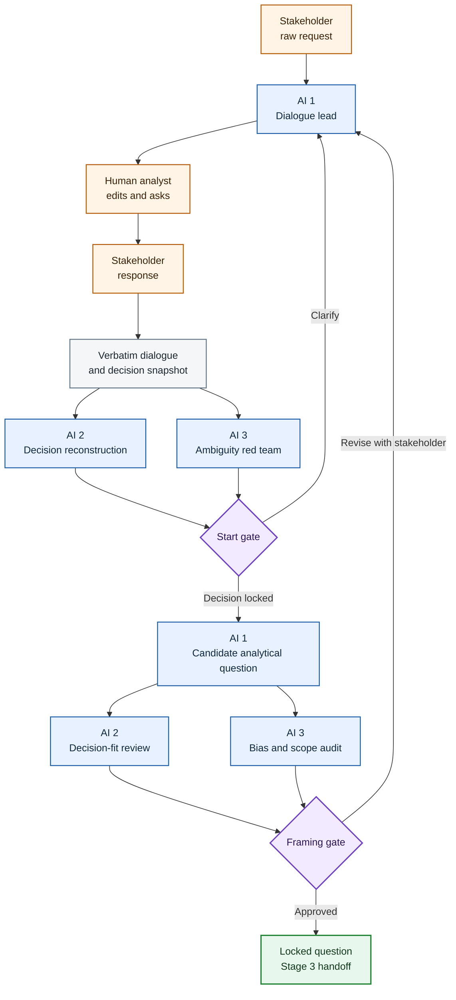
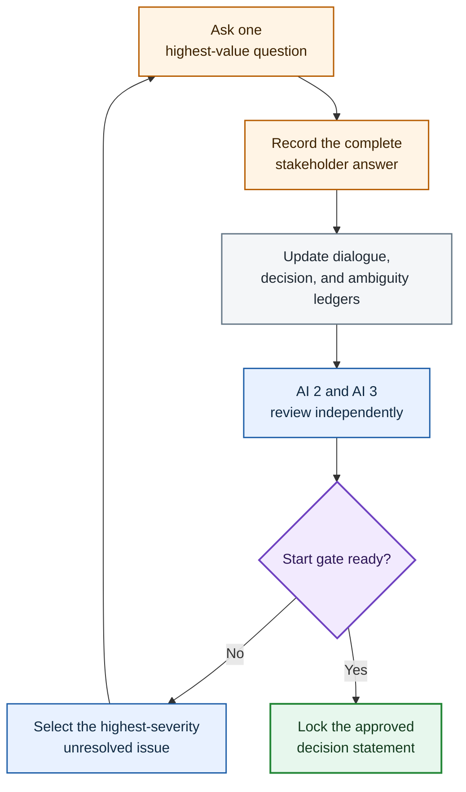

# Three-AI Start and Framing Dialogue Framework

This framework governs the first two phases of the five-stage AI-Augmented Analyst process:

1. **Start:** Discover the business decision concealed behind an initial request for data, a metric, a dashboard, or an analysis.
2. **Framing:** Convert that decision into one precise analytical question that can control the later measurement design.

The two phases belong in one conversational process because the analytical question cannot be framed correctly until the real decision has been uncovered. They remain separate gates because identifying a decision is not the same as specifying the question that analysis must answer.

The framework is designed for a live exchange between:

- a **stakeholder or requester**, who understands the practical need;
- the **human analyst**, who conducts the relationship and owns the eventual handoff;
- and **three AI systems**, which perform distinct dialogue, decision, and review functions.

The three AIs contribute different forms of control:

- **AI 1 preserves conversational continuity** and drafts the next stakeholder-facing turn.
- **AI 2 independently reconstructs the decision** behind the request.
- **AI 3 attacks ambiguity, bias, and premature framing** before the question is locked.

The governing principle is:

> Start discovers what must be decided. Framing determines exactly what must be learned to support that decision.

The purpose is not to make three AIs vote on the wording of a question. It is to expose different failure risks before the human analyst and stakeholder lock the question.

The human analyst remains the conversational bridge. AI 2 and AI 3 review the same evidence independently; AI 1 converts their findings into one coherent next turn.

## 1. Position within the five-stage process

The complete process is:

| Stage | Function | Controlling output |
|---|---|---|
| 1. Start | Surface the business decision | Approved decision statement |
| 2. Framing | Lock the analytical question | Approved framing question |
| 3. Design | Define hypothesis, population, grain, KPIs, segments, confounders, and decision rules | Locked measurement design |
| 4. Execution | Construct and validate the evidence | Reconciled analytical outputs |
| 5. Finish | Interpret the evidence and recommend action | Evidence-traceable decision |

This document governs only Stages 1 and 2 and the handoff into Stage 3.

It must not prematurely perform Stage 3 by locking technical metric definitions, thresholds, SQL logic, statistical tests, or model specifications. It may record known constraints that Stage 3 must resolve.

## 2. What Start and Framing must establish

Start and Framing answer different questions.

| Phase | Governing question | Required result |
|---|---|---|
| Start | What decision is this analysis meant to support? | A real decision with an owner, possible actions, intended outcome, constraint, and time scope |
| Framing | What single analytical question must be answered to support that decision? | One precise, neutral, answerable, decision-linked question |

Neither phase asks merely, “What metric does the stakeholder want?”

A request such as “Give me seller late-delivery rates” may conceal several different decisions:

- Which sellers should receive intervention?
- Which regions require operational escalation?
- Should the marketplace change a general fulfillment policy?

Those decisions could require different populations, comparisons, outputs, and methods. Beginning with the requested metric can therefore produce technically correct work that answers the wrong business question.

## 3. Human authority and AI boundaries

### 3.1 Stakeholder or requester

The stakeholder supplies:

- the practical problem;
- the decision context;
- the available actions;
- operational constraints;
- timing;
- consequences of acting or not acting;
- exceptions that matter;
- and confirmation that the final question reflects the need.

The stakeholder is not required to formulate the analytical question in technical language.

### 3.2 Human analyst

The human analyst:

- conducts the live relationship;
- decides which AI-drafted message to send;
- edits wording for tone and context;
- records stakeholder answers accurately;
- distinguishes a stakeholder preference from an analytical fact;
- resolves business judgments that cannot be delegated;
- and approves the final handoff into Stage 3.

The AIs advise the human analyst. They do not silently become the decision owner.

### 3.3 Non-substitution rule

No AI may invent a stakeholder response, fill a missing business constraint from plausibility, or treat its own prediction of the stakeholder's intention as confirmation.

If a material answer is missing, the process must:

1. ask the stakeholder;
2. adopt an explicitly labeled working assumption with human approval; or
3. record that no decision can yet be framed and pause.

## 4. The three AI roles

### AI 1 — Dialogue Lead and Conversation Architect

AI 1 manages the external conversational path.

Its responsibilities are to:

- acknowledge the stakeholder's actual request;
- distinguish the requested output from the decision it may support;
- offer two or three plausible decision options when the decision is unclear;
- ask one concise question per stakeholder-facing turn;
- incorporate the stakeholder's last answer before asking the next question;
- draft candidate decision statements and framing questions;
- preserve the stakeholder's important wording and qualifications;
- and maintain the current Decision Snapshot.

AI 1 is the only AI whose proposed language is normally sent directly to the stakeholder. The human analyst reviews and sends it.

AI 1 must not overwhelm the stakeholder with the internal three-AI review. It converts internal findings into one natural next message.

### AI 2 — Decision Architect and Independent Reconstructor

AI 2 receives the raw request, verbatim dialogue, and current Decision Snapshot. Before seeing AI 3's review, it independently reconstructs:

- the decision owner;
- the actual choice or action;
- realistic alternatives;
- the outcome being protected or improved;
- the decision deadline or time horizon;
- operational constraints;
- required distinctions or exceptions;
- what evidence would change the decision;
- and the strongest candidate analytical question.

AI 2 looks for the decision logic underneath the stakeholder's language. It does not rewrite the stakeholder's goal merely because a different goal would be easier to analyze.

### AI 3 — Skeptical Framing Reviewer and Ambiguity Red Team

AI 3 receives the same raw request, verbatim dialogue, and Decision Snapshot, but not AI 2's initial reconstruction.

AI 3 tests for:

- metric-first framing;
- ambiguous decision ownership;
- false or incomplete action menus;
- leading questions;
- solution-first reasoning;
- multiple decisions hidden inside one request;
- vague outcomes;
- missing time scope;
- ignored capacity or resource constraints;
- descriptive questions being mistaken for decision questions;
- causal language unsupported by the likely evidence;
- questions that cannot change an action;
- and questions narrowed merely to fit currently convenient data.

AI 3 must state the strongest alternative frame when it believes the current frame is wrong.

### No-majority-vote rule

The three AIs do not choose a question by voting.

A proposed frame survives because it:

- follows from the stakeholder's recorded statements;
- identifies an actual decision;
- survives ambiguity and bias review;
- can plausibly be answered through analysis;
- and is approved by the human analyst and stakeholder.

If evidence does not settle an issue, mark it **Open**, **Disputed**, or **Working assumption**.

## 5. Information boundaries

The initial independence of AI 2 and AI 3 matters.

Both receive the same packet:

- original stakeholder request;
- complete verbatim dialogue to date;
- current Decision Snapshot;
- known organizational context;
- and a list of unresolved items.

They do not see each other's first-pass conclusions.

After both reviews are complete, AI 1 receives them together and constructs the next stakeholder-facing message. This prevents one early interpretation from anchoring all three systems.

The stakeholder normally sees:

- one acknowledgment;
- two or three decision options when useful;
- one clarifying question at a time;
- concise summaries for confirmation;
- and the final proposed analytical question.

The stakeholder does not need to read three competing AI reports.

## 6. Required records and ledgers

### 6.1 Verbatim Dialogue Ledger

| Field | Required content |
|---|---|
| Turn ID | Stable sequential identifier |
| Speaker | Stakeholder, human analyst, or AI-assisted analyst message |
| Exact wording | Complete verbatim turn |
| Date/time | When the exchange occurred |
| Phase | Start or Framing |
| Analytical effect | What the turn changed, confirmed, or left open |

Paraphrases may be added, but they may not replace the verbatim record.

### 6.2 Decision Ledger

| Field | Required content |
|---|---|
| Decision element | Owner, action, alternative, outcome, constraint, time, exception, output |
| Current statement | Exact current interpretation |
| Supporting turn | Dialogue Turn ID |
| Status | Confirmed, inferred, disputed, open, or working assumption |
| Consequence | Effect on the final question |

### 6.3 Ambiguity Ledger

| Field | Required content |
|---|---|
| Ambiguity ID | Stable identifier |
| Missing or conflicting point | Exact issue |
| Why it matters | How it could change the decision or question |
| Severity | Blocking, material, or minor |
| Best next question | One question only |
| Resolution | Answer, assumption, exclusion, or open issue |

### 6.4 Candidate Question Ledger

| Field | Required content |
|---|---|
| Candidate ID | Stable identifier |
| Exact question | One sentence |
| Decision supported | Exact approved decision |
| Supporting dialogue | Relevant Turn IDs |
| Assumptions | Unconfirmed content required by the question |
| AI 2 assessment | Decision logic and analytical value |
| AI 3 assessment | Ambiguity, bias, and inferential risks |
| Stakeholder response | Accept, revise, reject, or not reviewed |
| Final status | Promote, revise, branch, reject, or open |

### 6.5 Revision and Decision Trail

Every material change must record:

- the earlier wording;
- the revised wording;
- who requested the change;
- the stakeholder statement or review finding that caused it;
- and the analytical consequence.

The final question must be traceable back to the actual conversation.

## 7. Phase A — Intake and configuration

Before AI 1 responds, record:

- stakeholder's original message verbatim;
- stakeholder identity or functional role;
- human analyst responsible for the conversation;
- known organizational context;
- whether the exchange is live, asynchronous, or simulated;
- and any known deadline.

Do not interpret the original request as the final question.

Classify the request provisionally:

- metric request;
- dashboard request;
- diagnostic request;
- comparison request;
- prediction request;
- recommendation request;
- policy question;
- or unclear.

This classification helps identify risk; it does not lock the analysis.

## 8. Phase B — Start dialogue

### 8.1 First response rule

AI 1's first message should:

1. briefly acknowledge the requested metric or output;
2. translate it into two or three plausible business decisions;
3. avoid claiming that those options are exhaustive;
4. end by asking which decision the stakeholder is trying to make.

General pattern:

> I can help with **[requested output]**. That could support decisions such as **[decision A]**, **[decision B]**, or **[decision C]**. Which decision are you trying to make?

The human analyst may rewrite this for naturalness before sending it.

### 8.2 Decision-option standard

The options must be actions, allocations, interventions, or choices—not merely analytical topics.

Weak options:

- Analyze performance.
- Review trends.
- Understand the metric.

Stronger options:

- Decide which sellers should receive intervention.
- Decide whether operational resources should be shifted toward particular regions.
- Decide whether to change a marketplace-wide fulfillment policy.

### 8.3 Stakeholder answer handling

When the stakeholder replies, AI 1 must:

- acknowledge the selected or revised decision;
- preserve qualifications and exceptions;
- update the Decision Ledger;
- avoid asking a new multi-part questionnaire;
- and identify the single uncertainty whose resolution would most change the frame.

### 8.4 Rescue paths

If the stakeholder remains vague, AI 1 may narrow the exchange:

> Is the immediate decision closer to **[A]** or **[B]**?

If the stakeholder says, “I only need the numbers,” AI 1 should explain briefly that the same number can support different actions, then either:

- propose an explicitly labeled working decision for approval; or
- provide a non-decision reporting request and pause the decision framework.

If several stakeholders are involved, identify whose decision the analysis must support. Other stakeholders may supply requirements, but the project needs a controlling decision owner.

If the decision has already been made and the request merely seeks justification, record that risk explicitly. Do not disguise confirmation-seeking as open analysis.

## 9. Phase C — Independent Start review

After the stakeholder has reacted to the initial decision options, pause external questioning long enough for AI 2 and AI 3 to review independently.

### AI 2 Start review

AI 2 returns:

1. Best reconstruction of the decision.
2. Decision owner.
3. Available actions or choices.
4. Intended outcome.
5. Material constraint.
6. Time scope or deadline.
7. Evidence that would change the action.
8. Strongest remaining ambiguity.
9. Best next stakeholder question.
10. Preliminary decision statement.

### AI 3 Start review

AI 3 returns:

1. Strongest reason the reconstructed decision may be wrong.
2. Any missing decision option.
3. Any leading or loaded language.
4. Any conflict between stated outcome and proposed action.
5. Any hidden secondary decision.
6. Any capacity, authority, or timing problem.
7. Whether the analysis could actually change the decision.
8. Strongest alternative decision statement.
9. Best falsifying stakeholder question.
10. Start gate verdict: **Pass**, **Revise**, or **Cannot yet frame**.

## 10. Phase D — Start reconciliation and dialogue loop

AI 1 compares the two independent reviews against the verbatim dialogue.

It creates a Consolidated Start Issue List:

- **Confirmed:** Directly supported by stakeholder language.
- **Inferred:** Reasonable but not confirmed.
- **Contradicted:** Inconsistent with a stakeholder statement.
- **Blocking:** Must be resolved before framing.
- **Deferred:** Properly belongs to Stage 3.

AI 1 then drafts one next question addressing the highest-severity unresolved issue.

The human analyst sends the question, records the stakeholder's complete answer, and returns the answer to all three AIs through an updated packet.

Repeat only as needed:

The process is iterative, but it is not an endless interview. After two unsuccessful rescue attempts on the same issue, the human analyst must choose among:

- request a direct stakeholder decision;
- propose a clearly labeled working assumption;
- narrow the project;
- or pause because no actionable decision has been established.

## 11. Start Gate

Start passes only when the following are explicit enough to control Framing:

| Requirement | Gate question |
|---|---|
| Decision owner | Who will use the analysis to choose or act? |
| Action or choice | What could the owner do differently? |
| Alternatives | What realistic options are being compared? |
| Outcome | What business result should improve, be protected, or be avoided? |
| Constraint | What capacity, resource, risk, or policy limit materially shapes the decision? |
| Time scope | By when must the decision be made, and over what horizon will it operate? |
| Analytical relevance | Could different evidence rationally change the action? |
| Stakeholder confirmation | Has the stakeholder confirmed or corrected the decision statement? |

The Start output is a single approved statement:

> **[Decision owner] must decide whether/which [action or choice] in order to [outcome], subject to [material constraint], by/for [time scope].**

If this statement cannot be completed without invention, Start has not passed.

## 12. Phase E — Framing dialogue

Framing begins only after the Start Gate passes.

The goal is not to add every possible analytical detail. The goal is to produce the one question whose answer would best support the approved decision.

### 12.1 First Framing question

AI 1 acknowledges the approved decision and asks exactly one concise question that resolves the largest remaining ambiguity about:

- the action;
- the priority outcome;
- the resource choice;
- the unit of decision;
- the time horizon;
- or a material exception.

AI 1 may offer up to three realistic alternatives inside that one question when doing so makes it easier to answer.

Example form:

> For this decision, should the analysis prioritize **[outcome A]**, **[outcome B]**, or **[outcome C]**?

Do not ask:

> What outcome matters, which population should we use, what date range do you want, what threshold applies, and how should the results be presented?

That is five questions disguised as one turn.

### 12.2 Candidate analytical question pattern

The candidate question will often take this form:

> **Which [units, entities, segments, or options] should [decision owner] [act on, prioritize, select, or avoid] to improve or protect [outcome] over [time horizon], subject to [constraint or capacity limit], while separately identifying [material exception]?**

Use only elements supported by the dialogue. Omit unnecessary clauses. Natural clarity is more important than filling a template.

### 12.3 Framing boundaries

The final question should ordinarily identify:

- decision owner;
- action or choice;
- unit, population, or decision target;
- outcome;
- time scope;
- material constraint or capacity;
- and any exception essential to the decision.

It should not ordinarily lock:

- an exact KPI formula;
- a SQL grain;
- an arbitrary threshold;
- a statistical test;
- a model class;
- or a preferred conclusion.

Those belong in Stage 3 unless the stakeholder's decision itself fixes them.

## 13. Phase F — Independent Framing review

AI 1, AI 2, and AI 3 do not all rewrite the same question blindly.

### AI 1 Builder output

AI 1 produces:

- the proposed final question;
- one-sentence decision linkage;
- the stakeholder statements supporting each clause;
- explicit working assumptions;
- and the one remaining weakness, if any.

### AI 2 Decision-fit review

AI 2 tests:

- Does answering the question support the approved decision?
- Could materially different answers lead to different actions?
- Are the owner and action visible?
- Is the outcome the stakeholder's outcome rather than the AI's preferred metric?
- Are the unit and time scope appropriate?
- Is the capacity constraint represented?
- Is the question narrow enough to govern Stage 3?
- Is it broad enough not to exclude a relevant answer in advance?

AI 2 returns **Keep**, **Tighten**, **Branch**, or **Reject**, with exact reasons.

### AI 3 Framing red-team review

AI 3 tests:

- Is the question leading toward a predetermined recommendation?
- Does it assume causality when the project may establish only description, association, or prediction?
- Does it combine multiple decisions?
- Does it privilege the requested metric before the outcome is defined?
- Does it omit a realistic decision option?
- Is any clause unsupported by the dialogue?
- Could the question be answered accurately yet remain useless for action?
- Has data convenience distorted the business need?
- Has a material stakeholder exception disappeared?
- What is the strongest alternative wording?

AI 3 returns **Pass**, **Pass with required revision**, or **Fail**.

## 14. Phase G — Stakeholder validation loop

After internal review, AI 1 creates one clean stakeholder-facing message containing:

1. the proposed analytical question;
2. a brief statement of the decision it supports;
3. one request to confirm or correct it.

Example form:

> Based on what you described, I would frame the analysis as: **[candidate question]**. This would support your decision about **[decision]**. What, if anything, should be corrected before we lock it?

The stakeholder may:

- approve it;
- revise a term;
- add a constraint;
- identify an exception;
- reveal that the decision was misunderstood;
- or reopen Start.

A stakeholder correction is not a cosmetic edit if it changes the owner, action, outcome, constraint, population, or time scope. Such a correction returns to the appropriate earlier gate.

AI 2 and AI 3 review only material revisions. They need not re-review punctuation or stylistic edits that do not change meaning.

## 15. Framing Gate

The final question passes only when:

- it is one primary analytical question;
- the decision owner is identifiable;
- the action or resource choice is clear;
- the unit or target is sufficiently bounded;
- the intended outcome is explicit;
- the time scope is defined;
- the material capacity or policy constraint is represented;
- required outputs or exceptions are recorded;
- the wording does not assume the desired answer;
- causal language does not exceed the intended evidence;
- the question could plausibly be answered through analysis;
- different supported answers could lead to different actions;
- no blocking AI 3 objection remains unresolved;
- the stakeholder has approved or corrected it;
- and the human analyst approves the handoff.

Reviewer agreement is not stakeholder approval. Stakeholder approval is not proof of analytical validity. Both are required for different reasons.

## 16. Handoff to Stage 3 Measurement Design

The Stage 3 team receives a Start-and-Framing Handoff Package containing:

### Locked content

- original request;
- approved decision statement;
- approved analytical question;
- decision owner;
- possible actions;
- intended outcome;
- relevant unit or decision target;
- time scope;
- capacity, resource, risk, or policy constraints;
- required exceptions;
- required output form, if the stakeholder specified one;
- and stakeholder approval record.

### Open design work

Stage 3 must still define:

- formal hypothesis;
- exact population and exclusions;
- analytical grain;
- KPI formulas;
- numerator and denominator;
- comparison groups;
- segments;
- confounders;
- thresholds;
- statistical or predictive methods;
- decision rules;
- validation criteria;
- and known limitations.

The Stage 3 team may challenge feasibility or expose a contradiction. It may not silently rewrite the approved decision. If a feasibility finding materially changes the question, return to the stakeholder through the Start-and-Framing loop.

## 17. Dialogue operating rules

### One external question at a time

Ask one stakeholder-facing question per turn. A question may contain a short choice set, but it must resolve one ambiguity.

### Acknowledge before narrowing

The next turn must show that the stakeholder's last answer was understood. Repeated generic questions destroy conversational continuity.

### Preserve verbatim language

Record every stakeholder turn exactly. Summaries are useful, but the exact statement controls when a later summary is challenged.

### Keep internal review internal

The stakeholder receives one coherent conversational message, not three AI reports.

### Distinguish facts, preferences, and assumptions

- A stakeholder statement about a business priority is a controlling preference.
- A stakeholder statement about the data is a claim to verify later.
- An AI completion of missing context is an assumption, not a fact.

### Respect conversational repair

Stakeholders often discover what they mean while responding. The process must allow them to reject the offered options, rename the decision, or reopen an earlier answer.

### Stop when no decision exists

Not every reporting request supports an immediate decision. If no action, owner, or choice can be established, document a reporting request rather than inventing a decision.

## 18. Simulation and training mode

When no live stakeholder is available, one AI may simulate the stakeholder for training or portfolio development. The simulation must be labeled synthetic.

A useful training allocation is:

| Participant | Role |
|---|---|
| Stakeholder AI | Maintains a stable persona, operational problem, priorities, and constraints |
| Analyst AI | Conducts Start and Framing one turn at a time |
| Reviewer AI | Audits the dialogue and final frame independently |
| Human owner | Approves the scenario, intervenes when needed, and locks the final question |

In simulation mode:

- the stakeholder AI must not reveal its complete hidden brief at once;
- the analyst must discover relevant information through dialogue;
- the reviewer must see the complete transcript;
- every spoken turn must be preserved verbatim;
- and synthetic approval must never be presented as real stakeholder validation.

In a real project, the live stakeholder replaces the simulated stakeholder. The three-AI architecture in Sections 4–15 remains the stronger review design.

## 19. Failure conditions

The process fails if:

- the requested metric is accepted as the final analytical question without decision discovery;
- the AIs invent the stakeholder's answer;
- three AIs independently produce questions but never conduct a real dialogue;
- AI 2 or AI 3 anchors on the other's first draft before independent review;
- the stakeholder receives several competing AI interrogations;
- the analyst asks a multi-part questionnaire in one turn;
- decision options are analytical topics rather than possible actions;
- the offered options are treated as exhaustive;
- the stakeholder's correction is ignored because the AIs prefer their frame;
- a paraphrase replaces the verbatim dialogue;
- qualifiers, exceptions, or capacity constraints disappear during summarization;
- the decision owner is ambiguous;
- several decisions are compressed into one question;
- the question is descriptive but the project expects a recommendation;
- the question is written to justify a decision already made without disclosure;
- the desired conclusion is embedded in the question;
- causal language is used without an appropriate evidential design;
- current data convenience is allowed to redefine the business decision;
- exact KPI definitions or methods are prematurely locked before Stage 3;
- AI disagreement is resolved by majority vote;
- a blocking red-team objection is hidden;
- an unresolved business question is mislabeled an analytical assumption;
- the process loops indefinitely without a working assumption, narrowing decision, or pause;
- stakeholder approval is inferred rather than recorded;
- or the Stage 3 handoff cannot trace the final question to the dialogue.

## 20. Required deliverables

The process produces:

1. `01_ORIGINAL_REQUEST_AND_VERBATIM_DIALOGUE.md`
2. `02_START_DECISION_OPTIONS.md`
3. `03_DECISION_AND_AMBIGUITY_LEDGERS.md`
4. `04_INDEPENDENT_START_REVIEWS.md`
5. `05_APPROVED_DECISION_STATEMENT.md`
6. `06_CANDIDATE_ANALYTICAL_QUESTIONS.md`
7. `07_INDEPENDENT_FRAMING_REVIEWS.md`
8. `08_STAKEHOLDER_REVISIONS_AND_APPROVAL.md`
9. `09_FINAL_ANALYTICAL_QUESTION.md`
10. `10_STAGE_3_MEASUREMENT_DESIGN_HANDOFF.md`

These files may be combined into one controlled document if every section and ledger remains identifiable.

## 21. Compact operating sequence

1. Record the original request verbatim.
2. AI 1 acknowledges the request and offers two or three plausible decisions.
3. The human analyst sends the message to the stakeholder.
4. Record the stakeholder's complete answer.
5. AI 2 independently reconstructs the decision.
6. AI 3 independently attacks ambiguity, bias, and false framing.
7. AI 1 consolidates the findings against the transcript.
8. Ask the stakeholder one highest-value question at a time.
9. Repeat until the Start Gate passes or the project pauses.
10. Lock the approved decision statement.
11. AI 1 drafts the analytical question.
12. AI 2 tests decision fit and actionability.
13. AI 3 red-teams neutrality, scope, inference, and answerability.
14. AI 1 presents one revised question to the stakeholder.
15. Record stakeholder confirmation or correction.
16. Reopen the appropriate gate after any material change.
17. Lock the final question only after the Framing Gate passes.
18. Send the complete handoff into Stage 3 Measurement Design.

## 22. Final completion standard

Start and Framing are complete only when:

- the original request is preserved;
- the business decision has been distinguished from the requested metric or output;
- the decision owner, action, outcome, constraint, and time scope are explicit;
- the stakeholder's qualifications and exceptions remain visible;
- AI 2 has independently reconstructed the decision;
- AI 3 has independently tested the frame;
- no material disagreement has been resolved by voting;
- each external turn asked no more than one central question;
- the approved decision statement is traceable to the dialogue;
- the final analytical question is singular, neutral, actionable, and plausibly answerable;
- the stakeholder has approved or corrected the final question;
- the human analyst has approved the handoff;
- and Stage 3 can begin without guessing what decision the analysis is meant to support.

The final governing rule is:

> Do not analyze the requested metric until the dialogue has established the decision. Do not design the measurement until the decision has been converted into one approved analytical question.

End of framework.
