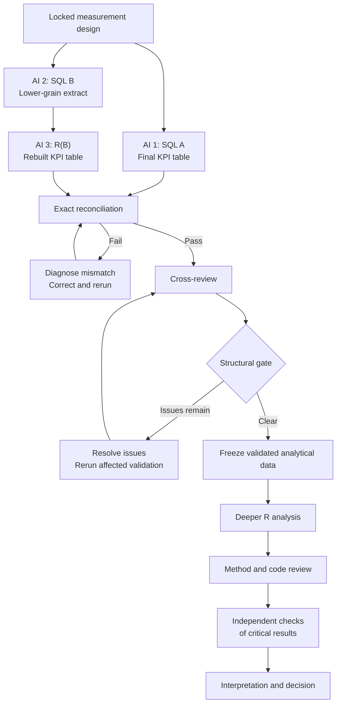

# Three-AI Independent Validation and Analysis Framework

This framework describes an end-to-end system for using three independent AI systems to construct, validate, review, analyze, and interpret business data. It begins with a locked measurement design and ends with an evidence-traceable recommendation.

The three AIs perform different functions as the type of error risk changes:

- During data construction, they act as independent builders.
- During cross-review, they inspect one another's work for hidden structural weaknesses.
- During deeper R analysis, they become a builder, a methodological critic, and an implementation critic.
- During interpretation, they test whether the recommendation is genuinely supported by the validated evidence.

The governing principle is:

> Agreement between independent implementations tests whether the data was constructed correctly. Cross-review tests whether the implementations share hidden weaknesses. Deeper-analysis review tests whether the conclusions drawn from the validated data are sound.

## 1. What the system is designed to establish

There are five separate questions. No single test answers all five.

| Validation layer | Central question |
|---|---|
| Measurement validity | Did we define the right population, grain, KPI, comparison, and decision rules? |
| Construction validity | Did the SQL and R implementations correctly construct those definitions? |
| Structural robustness | Could the implementations agree while still containing a hidden weakness? |
| Analytical validity | Are the statistical, descriptive, or predictive methods appropriate? |
| Decision validity | Does the final recommendation actually follow from the validated evidence? |

An exact match between SQL and R does not automatically prove that:

- the original measurement design was correct;
- the queries are safe under every boundary condition;
- later statistical methods are appropriate;
- a predictive association is causal;
- or the final recommendation is justified.

Each phase contributes a different kind of assurance.

## 2. Phase 0: Lock the measurement design

Before any AI writes SQL or R, all three must receive the same controlling measurement design.

The design must specify at least:

- The business decision being supported
- The analytical question
- The unit of analysis
- The population
- Inclusion and exclusion rules
- The primary KPI
- KPI numerator
- KPI denominator
- Date and time rules
- Required segments
- Thresholds and volume floors
- Treatment of missing values
- Comparison groups or baselines
- Decision rules
- Required output columns
- Known limitations
- Database dialect and source tables

For a seller late-fulfillment analysis such as FulfillIQ, this could include:

- Delivered orders only
- The precise purchase-date window
- An inclusive lower date boundary
- An exclusive upper date boundary
- Both required delivery timestamps must be non-null
- Seller-order as the operational grain
- Date-based lateness as the primary definition
- Timestamp-based lateness as a secondary twin
- A minimum usable denominator of 30 seller-orders
- Seller Late-Fulfillment Rate as the primary KPI

### What “locked” means

Once construction begins, no AI may silently reinterpret or improve the measurement design.

If an AI finds ambiguity, it must report it. It cannot independently change:

- the population;
- the KPI definition;
- the grain;
- the date window;
- the threshold;
- or the decision rule.

For example, an AI cannot decide that timestamp-based lateness is more accurate and replace the locked date-based definition. It should instead implement the locked definition and separately flag the alternative for review.

This preserves the difference between implementing the owner's decision and reviewing a potential limitation in that decision.

### Version control before construction

Every AI must work from the same versions of:

- the measurement design;
- the database context;
- the schema or data dictionary;
- the data profile;
- and any source extracts.

At minimum, record:

- source-data version or extraction time;
- measurement-design version;
- SQL script version;
- R script version;
- row counts;
- and output creation time.

For a rigorous workflow, also calculate file hashes for the major inputs and outputs.

## 3. Preserve independence during initial construction

Independence is what makes agreement valuable.

If AI 2 sees SQL A and rewrites it with different formatting, SQL B is not independent. It is merely a translation of SQL A.

If AI 3 sees the SQL A results before writing R(B), it may consciously or unconsciously modify the R logic until the outputs match.

The three AIs should initially share:

- the locked measurement design;
- the source schema;
- the database context;
- and the required output contract.

Before reconciliation, they should not share their implementation decisions.

| AI | Initial responsibility | Primary output | Should not see initially |
|---|---|---|---|
| AI 1 | Construct the KPI directly in SQL | SQL A final KPI table | SQL B and R(B) |
| AI 2 | Construct a lower-grain analytical extract | SQL B lower-grain table | SQL A and R(B) |
| AI 3 | Rebuild the KPI from SQL B's extract in R | R(B) final KPI table | SQL A and its results |

The three systems are not doing the same job:

- SQL A calculates the final result inside the database.
- SQL B constructs a lower-grain dataset.
- R(B) independently applies the metric logic to that lower-grain dataset.

The final comparison is:

$$
\text{SQL A KPI table} \quad \text{versus} \quad \text{R(B) KPI table}
$$

## 4. AI 1: SQL A

### Purpose

SQL A is the direct database implementation of the locked measurement design. It moves from the approved source tables to the final KPI table.

For a seller-level KPI, its output might contain one row per seller with columns such as:

- `seller_id`
- `eligible_seller_orders`
- `late_seller_orders_date`
- `late_fulfillment_rate_date`
- `late_seller_orders_timestamp`
- `late_fulfillment_rate_timestamp`
- `volume_floor_pass`
- relevant audit counts

SQL A performs:

1. Population filtering
2. Grain construction
3. Eligibility determination
4. Lateness classification
5. Numerator calculation
6. Denominator calculation
7. Seller-level aggregation
8. Volume-floor classification

### Required SQL A controls

#### Grain

The intermediate table must contain one row per approved analytical unit.

In FulfillIQ, the critical grain is seller-order, not order item. An order with three item rows from the same seller must not accidentally count as three seller-orders.

#### Join cardinality

Every join must be assessed for possible duplication:

- Is the seller table unique by `seller_id`?
- Can an order contain multiple item rows from the same seller?
- Can a lookup table contain duplicate keys?
- Does a one-to-many join occur before or after the seller-order grain is established?

#### Population

AI 1 must apply the exact locked filters. The query should not substitute:

- shipment date for purchase date;
- order creation date for purchase timestamp;
- `BETWEEN` for a required half-open time interval;
- or all orders for delivered orders.

#### Eligibility

The denominator must contain only the records authorized by the design. A missing actual-delivery timestamp cannot be silently classified as on time.

#### Arithmetic

The KPI must use the correct components:

$$
\text{Late-Fulfillment Rate}
=
\frac{\text{Late eligible seller-orders}}
{\text{All eligible seller-orders}}
$$

AI 1 must preserve numerator and denominator counts. A final percentage alone is insufficient for validation.

## 5. AI 2: SQL B

### Purpose

SQL B is not supposed to imitate SQL A. Its purpose is to construct a lower-grain analytical dataset from which the KPI can be independently rebuilt in R.

For FulfillIQ, SQL B would normally produce one row per seller-order containing the raw or minimally transformed fields necessary for AI 3 to determine:

- whether the seller-order is eligible;
- whether it is late under the date definition;
- whether it is late under the timestamp definition;
- which seller receives the seller-order;
- and whether it falls inside the approved population and window.

Possible columns include:

- `seller_id`
- `order_id`
- `order_status`
- `order_purchase_timestamp`
- `order_delivered_customer_date`
- `order_estimated_delivery_date`
- item-row audit count
- seller-order key
- source-presence indicators

### Why SQL B should retain lower-grain fields

If SQL B calculates the final seller-level rate and AI 3 merely reads that rate into R, there is no independent R reconstruction.

The stronger design is:

- SQL B handles database extraction and necessary joins.
- R independently applies the eligibility, classification, and aggregation logic.

Where practical, SQL B should retain raw timestamps instead of handing R only a precomputed late flag. This allows AI 3 to independently implement the date and timestamp rules instead of trusting a classification created in SQL.

### How broad SQL B should be

Ideally, SQL B should be broad enough for AI 3 to apply the important analytical filters independently.

If SQL B removes null delivery timestamps before export, R cannot check whether the null-exclusion rule was implemented correctly because the excluded records have disappeared.

The best practical design is therefore to:

- preserve raw fields needed for the rules;
- preserve stable keys;
- avoid premature aggregation;
- retain exclusion indicators where feasible;
- and provide filter-stage audit counts.

If data volume forces SQL B to apply some filters, those filters must be documented and included in cross-review.

### Required SQL B controls

AI 2 should verify:

- one row per lower-grain analytical unit;
- no duplicate seller-order keys;
- required timestamps preserved;
- relevant boundary records retained or audited;
- no hidden aggregation;
- no accidental loss through inner joins;
- source counts before and after major filters;
- and a clear explanation of every transformation performed in SQL rather than R.

## 6. AI 3: R(B)

### Purpose

AI 3 receives SQL B's lower-grain dataset and independently reconstructs the final KPI table in R.

R is acting here as a second computational path, not yet as the deeper analytical engine.

AI 3 should use:

- the locked measurement design;
- the lower-grain SQL B extract;
- the required output schema;
- and the relevant column definitions.

It should not use SQL A as a template.

### R(B) responsibilities

R(B) must independently:

1. Confirm the expected lower-grain keys.
2. Check for duplicates.
3. Check data types.
4. Parse timestamps.
5. Apply locked population rules not already applied.
6. Determine eligibility.
7. Construct date-based lateness.
8. Construct timestamp-based lateness.
9. Aggregate seller-orders to seller-window.
10. Calculate numerator, denominator, and rate.
11. Apply the volume floor.
12. Produce the required comparison table.

### Preserve audit information

AI 3 should produce more than a final rate. Recommended validation outputs include:

- input row count;
- distinct seller count;
- distinct order count;
- distinct seller-order count;
- duplicate-key count;
- excluded-null count;
- eligible seller-order count;
- late seller-order count;
- seller count before the volume floor;
- seller count after the volume floor;
- date/timestamp disagreement count;
- and the final KPI table.

These intermediate totals help identify the point at which two paths diverge.

## 7. Exact reconciliation

### What must be compared

The reconciliation must compare more than the final KPI percentage.

#### Structure

- Required column names
- Data types
- Grain
- Number of rows
- Key uniqueness

#### Entity coverage

- Keys appearing only in SQL A
- Keys appearing only in R(B)
- Keys appearing in both

#### KPI components

For every seller or analytical entity:

- eligible denominator;
- late numerator;
- secondary numerator if applicable;
- volume-floor status;
- and final rate.

#### Global control totals

- Total eligible seller-orders
- Total late seller-orders
- Total sellers
- Sellers passing the volume floor
- Date-based late count
- Timestamp-based late count

### Exactness standard

For identifiers, counts, logical flags, and eligibility classifications, exact means exact.

There should be:

- zero unmatched keys;
- zero numerator differences;
- zero denominator differences;
- zero eligibility differences;
- and zero volume-floor differences.

Rates should be compared using unrounded underlying values.

Because SQL and R can represent floating-point values differently, the comparison may use a very small, predetermined numerical tolerance. This is not permission to ignore meaningful differences.

The proper rule is:

- compare counts exactly;
- compare classifications exactly;
- compare rates using unrounded values and a defined machine-level tolerance;
- round only for presentation.

Two rates that both display as `7.6%` are not reconciled if their underlying numerators or denominators differ.

### Reconciliation output

The reconciliation process should mechanically generate a report containing:

- pass/fail status;
- table-level row-count comparison;
- unmatched-key count;
- differing-row count;
- differing-column count;
- maximum numerical difference;
- global-control-total comparison;
- and a mismatch table when differences exist.

It should not depend on an AI visually inspecting two spreadsheets and deciding that they look the same.

## 8. What happens if reconciliation fails

A mismatch does not immediately establish which implementation is wrong.

SQL A could be wrong. SQL B could be wrong. R(B) could be wrong. The reconciliation code itself could also be comparing the outputs incorrectly.

The system must not automatically treat one path as the answer key.

### Initial mismatch classification

Common categories include:

- different key sets;
- different population filters;
- grain duplication;
- join loss;
- date-boundary handling;
- timezone conversion;
- null handling;
- date-versus-timestamp logic;
- denominator eligibility;
- threshold handling;
- aggregation order;
- integer-versus-floating arithmetic;
- or comparison-format problems.

### Failure-investigation responsibilities

#### AI 1

AI 1 reviews SQL A against the locked design, mismatch keys, and its audit counts. It explains how SQL A produced the disputed rows without initially assuming SQL B or R is correct.

#### AI 2

AI 2 reviews SQL B against the locked design, extraction counts, source-row examples, and disputed keys. It determines whether records were duplicated, removed, or transformed incorrectly.

#### AI 3

AI 3 reviews the R transformations, reconciliation code, data types, grouping, date conversion, and disputed rows.

### Evidence-based resolution

After the independent diagnoses, the AIs may see one another's explanations and challenge them.

The mismatch is resolved using:

- row-level source evidence;
- intermediate counts;
- the locked specification;
- and reproducible calculations.

It is not resolved by a two-to-one vote.

### Rerun rule

After any material correction:

1. Rebuild the affected output from the source.
2. Rerun all integrity checks.
3. Rerun the complete reconciliation.
4. Create a new reconciliation report.
5. Preserve the earlier failed report for the audit trail.

Manual edits to a result table are prohibited. A correction must be made in the SQL or R code and reproduced.

## 9. Cross-review after reconciliation

### Why cross-review is separate

Suppose SQL A and R(B) match exactly. That is strong evidence that the two paths produced the same answer. It does not prove that the shared answer is structurally safe.

Both paths might still contain:

- the same interpretation of an ambiguous filter;
- a join that happens not to duplicate rows in the current dataset;
- a date conversion that fails only under another timezone;
- a null case absent from the current data;
- or a threshold error that happens not to affect any current entity.

Reconciliation tests actual agreement on the present data. Cross-review looks for weaknesses that may not have produced an observed difference.

### Cross-review assignments

Once reconciliation passes, the information barriers are removed.

| Reviewer | Artifacts reviewed |
|---|---|
| AI 1 | SQL B and the R(B) wrangling |
| AI 2 | SQL A and the R(B) wrangling |
| AI 3 | SQL A and SQL B |

Each AI primarily reviews work it did not originally author.

### Cross-review checklist

#### Compliance with the locked design

- Does the code implement every locked rule?
- Was anything added, omitted, or reinterpreted?
- Are primary and secondary metrics correctly distinguished?
- Is the volume floor applied at the correct stage?

#### Grain

- Is each intermediate table at its declared grain?
- Can an order or seller-order appear more than once?
- Is deduplication legitimate, or does it conceal a join problem?
- Is aggregation occurring before all required dimensions are available?

#### Joins

- What is the expected cardinality of every join?
- Are unique keys actually unique?
- Could an inner join remove valid population members?
- Could a left join create missing attributes?
- Could future duplicate lookup keys multiply records?
- Are join assertions present?

#### Dates and time

- Are timestamps parsed consistently?
- Is the lower boundary inclusive?
- Is the upper boundary exclusive?
- Is date-based lateness distinguished from timestamp comparison?
- Could timezone conversion change the calendar date?
- Are missing or invalid timestamps handled explicitly?

#### Missing values

- Are missing values excluded, retained, or classified according to the design?
- Could a missing comparison return `FALSE` and be counted as on time?
- Are missing entity identifiers possible?
- Does a missing lookup value remove an otherwise valid observation?

#### Boundary conditions

For a seller late-fulfillment analysis, reviewers should inspect cases such as:

- purchase exactly at the start boundary;
- purchase exactly at the end boundary;
- actual and estimated delivery on the same date but at different times;
- actual delivery one day after the estimate;
- either delivery timestamp missing;
- seller with 29 eligible seller-orders;
- seller with exactly 30;
- seller with 31;
- one order containing multiple items from the same seller;
- one order containing items from multiple sellers.

#### Reproducibility

- Are package versions or environment requirements recorded?
- Are transformations deterministic?
- Are intermediate outputs generated from code?
- Can another analyst rerun the entire process?

### Counterexample testing

Cross-review should not be limited to reading code.

Reviewers can construct small synthetic test cases representing dangerous boundaries, such as:

- a seller-order with two item rows;
- a null actual-delivery timestamp;
- a same-day late timestamp;
- an observation exactly at the upper window boundary;
- and sellers at denominators 29, 30, and 31.

The expected result is derived directly from the locked specification. SQL and R are then tested against those cases. This exposes defects that the production data may not currently contain.

### Cross-review finding format

Every finding should contain:

- Finding ID
- Reviewer
- Artifact
- Severity
- Relevant locked rule
- Description
- Evidence
- Possible impact
- Required correction
- Owner
- Resolution
- Retest result

Suggested severity categories are:

- **Blocking:** Could change the population, grain, KPI, or decision.
- **Material:** Could change a meaningful subset or make future reruns unreliable.
- **Minor:** Readability, maintainability, or performance issue without a credible effect on the result.

### Resolving cross-review findings

No issue should be closed merely because the original author disagrees.

The process is:

1. Reviewer records the finding.
2. Author responds with evidence.
3. Code is corrected if necessary.
4. A different AI verifies the correction.
5. Any data-construction change triggers a new reconciliation.
6. The finding is marked resolved, accepted limitation, or unresolved.

If a reviewer discovers a problem in the locked measurement design itself, the AI must escalate it. The AIs cannot silently rewrite the design.

### Cross-review gate

The process moves forward only when:

- exact reconciliation still passes;
- no blocking structural issue remains;
- no material issue remains unresolved;
- accepted limitations are documented;
- and all required corrections have been independently verified.

Cross-review is the quality-control bridge between data construction and deeper analysis.

## 10. Freeze the validated analytical data

Once reconciliation and cross-review pass, the validated data should receive a stable version.

Otherwise, deeper analysis could unknowingly use:

- a newly refreshed extract;
- a changed query;
- a manually edited CSV;
- or a differently filtered dataset.

The frozen package should include:

- validated analytical dataset;
- row count;
- key-uniqueness results;
- source extraction time;
- SQL A version;
- SQL B version;
- R(B) version;
- reconciliation report;
- cross-review register;
- and a dataset hash where feasible.

### The boundary of validation

Validation applies only to the data and variables that were actually tested.

If deeper R analysis introduces:

- a new table;
- a new join;
- a new population restriction;
- a new outcome variable;
- a new time window;
- or new feature engineering,

those additions are not automatically validated by the earlier KPI reconciliation. They require a smaller validation cycle appropriate to the new material.

For example, if customer-review data is added during deeper analysis, earlier validation of orders, items, and sellers does not prove that the review join is correct.

## 11. Deeper R analysis

### R's role changes

Before the validation gate, R serves as the second computational clerk. Its job is to independently rebuild the core KPI.

After the gate, R becomes the primary analytical engine. It can perform work SQL A was never intended to reproduce:

- Descriptive analysis
- Distribution analysis
- Segmentation
- Visualization
- Hypothesis testing
- Feature engineering
- Predictive modeling
- Forecasting
- Sensitivity analysis
- Interpretation
- Decision support

### Do not begin with code

Before AI 1 writes the deeper R project, it should create an analysis plan specifying:

- analytical question;
- outcome variable;
- unit of analysis;
- required features;
- descriptive analyses;
- statistical tests;
- segmentation;
- model class, if any;
- train/test or temporal split;
- evaluation metrics;
- comparison baseline;
- decision thresholds;
- and intended outputs.

AI 2 should review the proposed method before extensive code is written. AI 3 should confirm that the required data and transformations are available.

## 12. Roles during deeper analysis

### AI 1: Analytical builder

AI 1 becomes the primary builder. Its responsibilities include:

- constructing the main R analysis;
- using the frozen validated data;
- producing tables and visualizations;
- implementing approved statistical methods;
- building models or forecasts;
- saving intermediate analytical objects;
- generating held-out predictions;
- and documenting how each output was produced.

AI 1 owns the coherent primary pipeline.

This is more useful than having all three AIs produce three complete R projects. Three full projects create unnecessary duplication, difficult comparison problems, inconsistent outputs, and substantial review overhead.

### AI 2: Methodological and statistical critic

AI 2 evaluates whether the analysis is conceptually and statistically defensible.

#### Descriptive analysis

- Are comparisons made at the correct grain?
- Are weighted and unweighted summaries distinguished?
- Are denominators consistent across segments?
- Are tiny segments being overinterpreted?
- Are distributions hidden by averages?

#### Statistical testing

- Is the test appropriate for the data?
- Are independence assumptions plausible?
- Are sample sizes sufficient?
- Are effect sizes reported alongside significance?
- Are confidence intervals included where appropriate?
- Is multiple testing controlled?
- Is statistical significance being confused with business importance?

#### Predictive modeling

- Is the target clearly defined?
- Is the prediction unit correct?
- Is the data split appropriate?
- Should the split be random or temporal?
- Is information leakage present?
- Were transformations learned only from training data?
- Is class imbalance handled appropriately?
- Is accuracy an appropriate metric?
- Is there a baseline model?
- Was the test set used only for final evaluation?
- Are probability calibration and threshold choice relevant?
- Is predictive importance being misrepresented as causation?

#### Forecasting

- Is chronological order preserved?
- Is the forecast horizon aligned with the business decision?
- Is rolling-origin validation used where appropriate?
- Are seasonality and trend handled?
- Are prediction intervals reported?
- Is the forecast compared with a naïve baseline?

#### Interpretation

- Does the language distinguish descriptive, associational, predictive, and causal claims?
- Are limitations material to the recommendation disclosed?
- Does the method actually answer the locked analytical question?

AI 2 can reject a method even if the code executes perfectly. A correctly calculated 82.4% accuracy is still not useful if accuracy is the wrong metric.

### AI 3: Code and data implementation critic

AI 3 reviews whether the approved analytical plan was correctly translated into R.

#### Data integrity

- Was the correct frozen dataset loaded?
- Are keys still unique where expected?
- Did a new join change the row count?
- Were records accidentally removed?
- Did the grain change?
- Are group totals consistent with global totals?

#### Data types and missingness

- Were timestamps parsed correctly?
- Were categorical variables converted properly?
- Were missing values handled as intended?
- Were missing categories silently dropped?
- Did imputation use training data only?

#### Tidyverse behavior

- Was lingering grouping left in place?
- Did `summarise()` or `mutate()` operate at the intended level?
- Did a many-to-many join create duplicates?
- Were factors reordered or collapsed correctly?
- Did pivoting alter uniqueness?

#### Modeling implementation

- Was the split created before preprocessing?
- Was the recipe prepared only on training data?
- Were test data used during tuning?
- Are truth and prediction columns aligned?
- Is the positive class correctly defined?
- Was the correct probability column used?
- Are metrics calculated on the intended held-out observations?
- Are model seeds and resampling objects reproducible?
- Are predictions joined back to entities without reordering errors?

#### Output integrity

- Do tables use the correct denominator?
- Do chart labels match the plotted variables?
- Are percentages presented as percentages?
- Are axes misleadingly truncated?
- Are model results taken from the final approved model?
- Does the exported output match the in-memory result?

AI 3 can approve the method in principle while finding that its implementation is wrong.

## 13. Independently verify critical results

Not every chart, table, or model must be reproduced three times.

Independent reproduction should focus on outputs that materially support the decision, including:

- primary segment rankings;
- effect estimates;
- confidence intervals;
- model accuracy or ROC AUC;
- recall for a priority class;
- forecast error;
- top risk classifications;
- revenue-uplift calculations;
- and decision-threshold results.

### Example: independently checking model accuracy

Suppose AI 1 reports:

> Held-out model accuracy = 82.4%.

AI 2 should receive the held-out truth and prediction columns and independently calculate:

$$
\text{Accuracy}
=
\frac{\text{Correct held-out predictions}}
{\text{All held-out predictions}}
$$

AI 2 should confirm:

- the number of held-out rows;
- the number of correct predictions;
- the resulting accuracy;
- that duplicate predictions are absent;
- and that all rows belong to the untouched test set.

AI 3 separately checks:

- how the test set was created;
- whether it entered preprocessing or tuning;
- whether predictions correspond to the correct rows;
- whether the correct model object was used;
- and whether the metric code references the intended columns.

These are different checks:

- AI 2 asks whether 82.4% is calculated correctly and is methodologically meaningful.
- AI 3 asks whether the pipeline genuinely produced a valid held-out prediction set.

### Targeted reproduction protocol

For each critical result:

1. Identify the exact claim.
2. Identify the source analytical object.
3. Identify the required numerator, denominator, or formula.
4. Have a non-builder independently recompute it.
5. Compare the independently calculated result with the reported result.
6. Investigate any difference.
7. Preserve the check as an artifact.

The reviewer should calculate from the underlying data or saved predictions, not copy the value from AI 1's summary table.

## 14. Review loop for deeper analysis

### First review round

After AI 1 completes the analysis:

- AI 2 submits a methodological review.
- AI 3 submits an implementation review.
- Neither reviewer initially edits AI 1's code.
- Each finding identifies evidence and possible impact.

### Builder response

AI 1 responds to each finding by accepting it, disputing it with evidence, asking for clarification, or explaining why it does not affect the result.

If a change is required, AI 1 modifies the analysis and reruns affected outputs.

### Verification round

The original reviewer verifies the correction. For important changes, the other reviewer also checks for downstream consequences.

For example, changing the train/test split may affect:

- feature preprocessing;
- tuning;
- model selection;
- evaluation metrics;
- calibration;
- feature importance;
- and the final recommendation.

The process must not correct the split while leaving obsolete model results elsewhere in the report.

### No voting rule

Disagreements are not resolved by majority vote.

An objection is resolved by:

- specification;
- mathematical definition;
- source data;
- code execution;
- statistical principle;
- or a targeted independent check.

If the disagreement represents a genuine methodological choice with no single demonstrably correct answer, both alternatives should be documented and tested through sensitivity analysis where practical.

## 15. Interpretation and recommendation

A valid model or statistical result does not automatically dictate a business recommendation.

The final phase must connect:

$$
\text{Validated data}
\rightarrow
\text{Analytical result}
\rightarrow
\text{Interpretation}
\rightarrow
\text{Decision rule}
\rightarrow
\text{Recommendation}
$$

Each link must be visible.

### AI responsibilities during interpretation

#### AI 1: Draft the synthesis

AI 1 produces the initial decision narrative:

- What was found?
- Why does it matter?
- Which decision option is supported?
- What should be done next?
- What uncertainty remains?

#### AI 2: Challenge the inference

AI 2 checks:

- whether associations are being described causally;
- whether uncertainty is understated;
- whether alternative explanations remain;
- whether the model is strong enough for the proposed use;
- whether decision thresholds were defined in advance;
- and whether the recommendation exceeds what the method can support.

#### AI 3: Trace claims to outputs

AI 3 verifies:

- that every number in the narrative matches an approved output;
- that segment labels are correct;
- that chart values match tables;
- that model metrics come from the held-out set;
- and that the recommendation uses the correct validated population.

### Claim-to-evidence ledger

Every important final claim should be linked to its source dataset, calculation, table or model object, independent check, and material limitation.

| Final claim | Evidence | Independent check | Limitation |
|---|---|---|---|
| High-risk sellers materially exceed the marketplace baseline | Approved seller KPI table | Recomputed segment contrast | Descriptive, not causal |
| Model accuracy is 82.4% | Held-out predictions | AI 2 independent calculation | Accuracy may conceal minority-class errors |
| Enrollment is recommended for specified sellers | Decision-rule table | AI 3 rule trace | Depends on the approved volume floor |

### Final decision standard

The final recommendation should answer:

- Which decision option is supported?
- What evidence supports it?
- What evidence would contradict it?
- What risks or limitations remain?
- What action should occur next?
- What result should be monitored after action?

The executive output can ultimately be compressed into three decision bullets, one primary chart, and three next actions. That compact output should sit on top of the complete evidence trail described here.

## 16. Required artifacts

| Artifact | Purpose |
|---|---|
| Locked measurement design | Controlling analytical specification |
| Database context | Tables, keys, relationships, and SQL constraints |
| Data profile | Counts, missingness, ranges, and distributions |
| SQL A | Direct final-KPI implementation |
| SQL A output | First final KPI table |
| SQL B | Independent lower-grain extraction |
| SQL B output | Data supplied to R(B) |
| R(B) script | Independent KPI reconstruction |
| R(B) output | Second final KPI table |
| Reconciliation script | Mechanical comparison |
| Reconciliation report | Evidence that the core KPI matches |
| Cross-review reports | Structural critique of SQL and R |
| Issue register | Findings, responses, corrections, and dispositions |
| Validated-data manifest | Version, counts, provenance, and hashes |
| Deeper R analysis | Main analytical pipeline |
| Methodological review | Statistical and inferential critique |
| Implementation review | R code and data-integrity critique |
| Critical-result checks | Independent reproduction of key outputs |
| Interpretation review | Claim-to-evidence verification |
| Final recommendation | Decision and next actions |

## 17. What each gate proves and does not prove

| Gate | What passing establishes | What it does not establish |
|---|---|---|
| Measurement design locked | Everyone is implementing the same specification | The specification is necessarily the best business definition |
| SQL A versus R(B) match | Independent paths produced the same core KPI table | Both paths are safe under unobserved conditions |
| Cross-review passes | No unresolved material structural defect was found | Every future data change will remain valid |
| Deeper-analysis review passes | Method and implementation are defensible | Predictions will remain accurate indefinitely |
| Critical results reproduce | Key reported values are computationally supported | The interpretation is automatically causal |
| Interpretation review passes | Recommendation is traceable to evidence and decision rules | The business action is risk-free |

## 18. Complete operating sequence

1. Lock what must be measured.
2. Give the same specification to three independent AIs.
3. Have AI 1 construct the final KPI directly in SQL.
4. Have AI 2 construct a lower-grain dataset through a separate SQL path.
5. Have AI 3 independently rebuild the KPI in R.
6. Reconcile SQL A against R(B).
7. If they differ, diagnose the mismatch without treating either path as automatically correct.
8. Correct the responsible implementation and rerun the full reconciliation.
9. After a match, remove the information barriers.
10. Cross-review the SQL and R implementations for hidden structural weaknesses.
11. Resolve every material finding through evidence, not voting.
12. Rerun reconciliation after any construction change.
13. Freeze the validated analytical data.
14. Use AI 1 to build the deeper R analysis.
15. Use AI 2 to review the methodology.
16. Use AI 3 to review the code and data implementation.
17. Independently reproduce the critical results that support the decision.
18. Correct and revalidate any analytical defects.
19. Trace every final claim to an approved analytical output.
20. Produce the interpretation, decision evaluation, and recommendation.

The core philosophy is:

> **Independent construction before agreement, adversarial review after agreement, specialized review during deeper analysis, and evidence-based resolution throughout.**

That is what turns three AIs from three potentially redundant code generators into a controlled analytical validation system.
